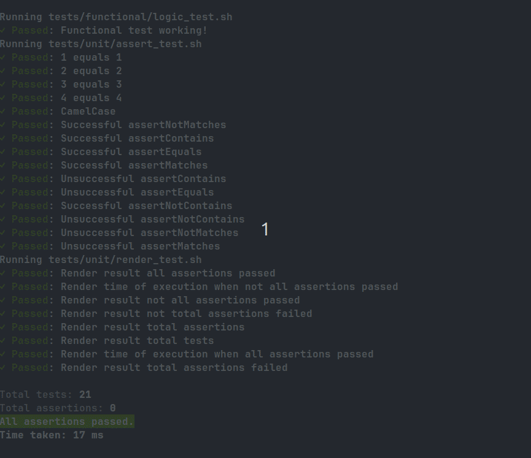
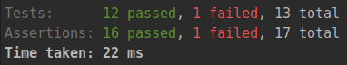
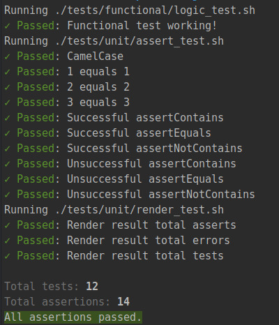

# Changelog

### Unreleased

- Added `assertExitCode`
- Added `assertSuccessfulCode`
- Added `assertGeneralError`
- Added `assertCommandNotFound`
- Added `assertArrayContains`
- Added `assertArrayNotContains`
- Improved the readability of the assert by using guard clause
- Assert that other assertion functions return the right exit code
- Update documentation
- Add support for the static analysis on MacOS
- Fix bug with watcher for the development of bashunit
- Fix error on count assertions
- Added pipeline to add contributors to the readme
- Added documentation with vitepress

### 0.5.0
### 2023-09-10

- Added logo
- Added `assertNotEquals`
- Added `assertMatches`
- Added `assertNotMatches`
- Added `make test/watch` to run your test every second
- Added time taken to run the test in ms (only to Linux)
- Simplified assertions over test results
- Added acceptance test to the library
- Added pre-commit to the project
- Allow parallel tests to run base on a .env configuration enabled by default
- Added static analysis tools to the deployment pipelines
  
- New summary output
  

### 0.4.0
### 2023-09-08

- Better output colors and symbols
- Add option `--filter` to `./bashunit` script
  - Trigger tests filtered by name
- Change the output styles
  - Emojis
  - Colors
  - Bolds
- Added count to all test

### 0.3.0
### 2023-09-07

- Added `assertContains`
- Added `assertNotContains`
- Display Passed tests in green, and Failed tests in red
- Avoid stop running tests after a failing one test

### 0.2.0
### 2023-09-05

- Fix keeping in memory test func after running them
- Create a `./bashunit` entry point
- Change ROOT_DIR to BASH_UNIT_ROOT_DIR
- Allow writing test with camelCase as well
- Allow running example log_test from anywhere

### 0.1.0
### 2023-09-04

- Added `assertEquals` function
