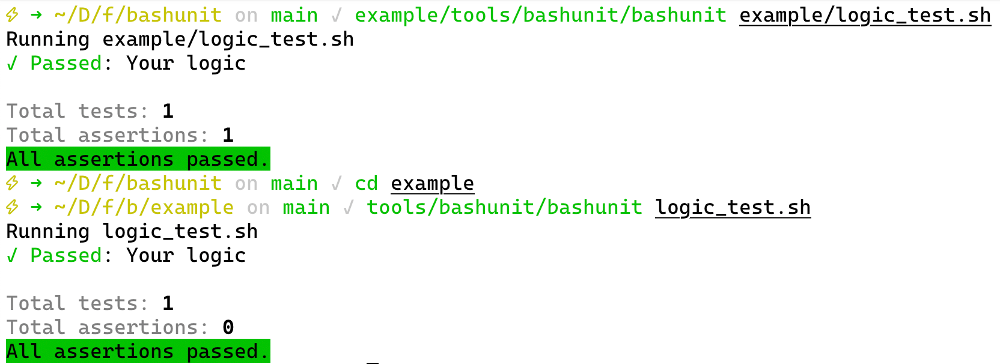
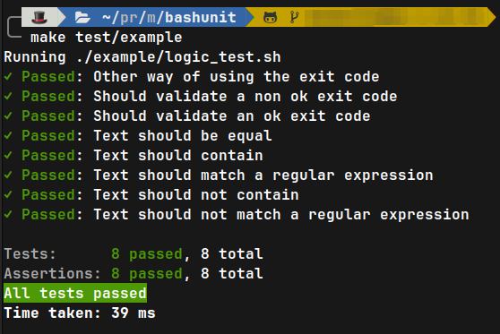

# bashunit example

An example using this **bashunit** testing library.

## Demo usage

This demo uses **bashunit** itself as [git-submodule](https://git-scm.com/book/de/v2/Git-Tools-Submodule) inside the `tools/bashunit` directory.

1) Install the git submodule
    ```bash
    git submodule add git@github.com:Chemaclass/bashunit.git tools/bashunit
    # (Optional) Update to the latest version
    git submodule update --remote
    ```
2) Run the tests
    ```bash
    tools/bashunit/bashunit logic_test.sh
    ```
   

   or use from the root directory use the `make` command
    ```bash
    make test/example
    ```
   

    If you want to run the test with the watcher you'll need to have installed [fswatch](https://github.com/emcrisostomo/fswatch)
    and run the following command:
    ```bash
    make test/watch/example
    ```

## Documentation

### assertEquals
**Syntax**
```bash
assertEquals "expected" "actual"
```

**Example:**
```bash
function test_text_should_be_equal() {
  assertEquals "expected 123" "expected 123"
}
```

### assertContains
**Syntax**
```bash
assertContains "expected" "actual"
```

**Example:**
```bash
function test_text_should_contain() {
  assertContains "expect" "expected 123"
}
```

### assertNotContains
**Syntax**
```bash
assertNotContains "expected" "actual"
```

**Example:**
```bash
function test_text_should_not_contain() {
  assertNotContains "expecs" "expected 123"
}
```

### assertMatches
**Syntax**
```bash
assertMatches "expected" "actual"
```

**Example:**
```bash
function test_text_should_not_contain() {
  assertMatches ".*xpec*" "expected 123"
}
```

### assertNotMatches
**Syntax**
```bash
assertNotMatches "expected" "actual"
```

**Example:**
```bash
function test_text_should_not_contain() {
  assertNotMatches ".*xpes.*" "expected 123"
}
```

### assertExitCode
**Syntax**
```bash
assertExitCode "expected" [execution of the function to test]
```

**Examples:**
```bash
function test_should_validate_a_non_ok_exit_code() {
  function fake_function() {
    return 1
  }
  fake_function
  assertExitCode "1"
}
```
```bash
function test_other_way_of_using_the_exit_code() {
  function fake_function() {
    return 1
  }
  assertExitCode "1" "$(fake_function)"
}
```

### assertSuccessfulCode
**Syntax**
```bash
assertSuccessfulCode [execute the function or command to assert]
```

**Examples:**
```bash
function test_successful_exit_code() {
  function fake_function() {
    return 0
  }
  assertSuccessfulCode "$(fake_function)"
}
```
```bash
function test_other_way_of_using_the_successful_exit_code() {
  function fake_function() {
    return 0
  }
  fake_function
  assertSuccessfulCode
}
```

### assertGeneralError
**Syntax**
```bash
assertGeneralError [execute the function or command to assert]
```

**Examples:**
```bash
function test_general_error() {
  function fake_function() {
    return 1
  }
  assertGeneralError "$(fake_function)"
}
```
```bash
function test_other_way_of_using_the_general_error() {
  function fake_function() {
    return 1
  }
  fake_function
  assertGeneralError
}
```

### assertCommandNotFound
**Syntax**
```bash
assertGeneralError [execute the function or command to assert]
```

**Examples:**
```bash
function test_should_assert_exit_code_of_a_non_existing_command() {
  assertCommandNotFound "$(a_non_existing_function > /dev/null 2>&1)"
}
```

## Real example

Looking for a more "real" example? There you go:
- [Chemaclass/conventional-commits](https://github.com/Chemaclass/conventional-commits/blob/main/tests/prepare-commit-msg_test.sh)
